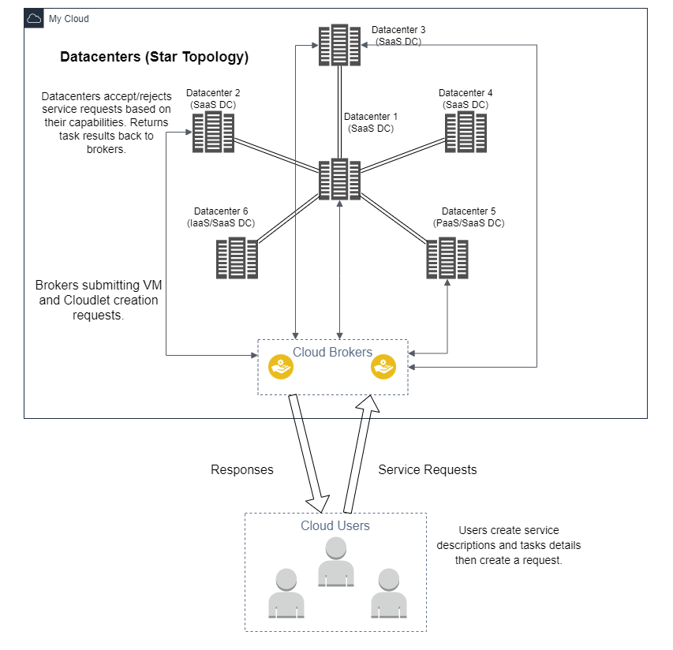

# CS441 Homework-3
## University of Illinois at Chicago
## Akshat Wagadre
## UIN - 654098103

## Introduction:
* In this homework, simulations of a Cloud Organisation is performed and analysed with different configurations
  using the CloudSimPlus cloud simulation framework.
* This project is completely built using Scala.

## Cloud Architecture Diagram:


## Prerequisites
* Java: JDK 18.0
* SBT


## Instructions to run the project.
1) Clone the project to your local machine.
2) Input parameters for the project are defined in the configuration files in the "resources" folder.
3) Use `sbt clean compile run` command in the terminal to launch the project.
4) Select the simulation to execute by choosing the appropriate number.


## Cloud Model:
### 1) Cloud simulations using Time Shared and Space Shared policies.
### 2) Network Cloud Simulation.
### 3) IaaS, Paas, SaaS example Simulations.

* More details about the models can be found in this [FILE](docs/CloudSimAnalysis.pdf).

## Docker Commands
* Commands used for building the image and pushing to dockerhub.
```
docker build -t cs441-cloudsimplus-hw3:v1 .
docker tag cs441-cloudsimplus-hw3:v1 akshatw97/cs441-cloudsimplus-hw3:v1
docker push akshatw97/cs441-cloudsimplus-hw3:v1 
```

* Pulling the project from dockerhub: `docker pull akshatw97/cs441-cloudsimplus-hw3:v1`
* Running the project: `docker run -it cs441-cloudsimplus-hw3:v1`

## Testing
* Unit tests are performed for checking the datacenter and host creation.
* Other tests include checking for configuration variable types.

## Thank You!